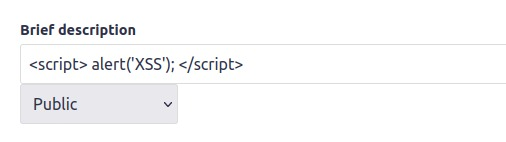
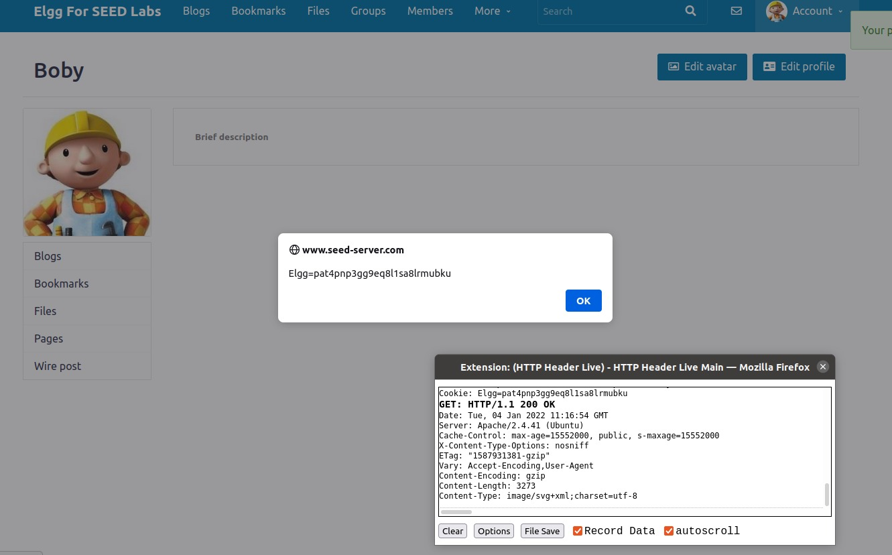
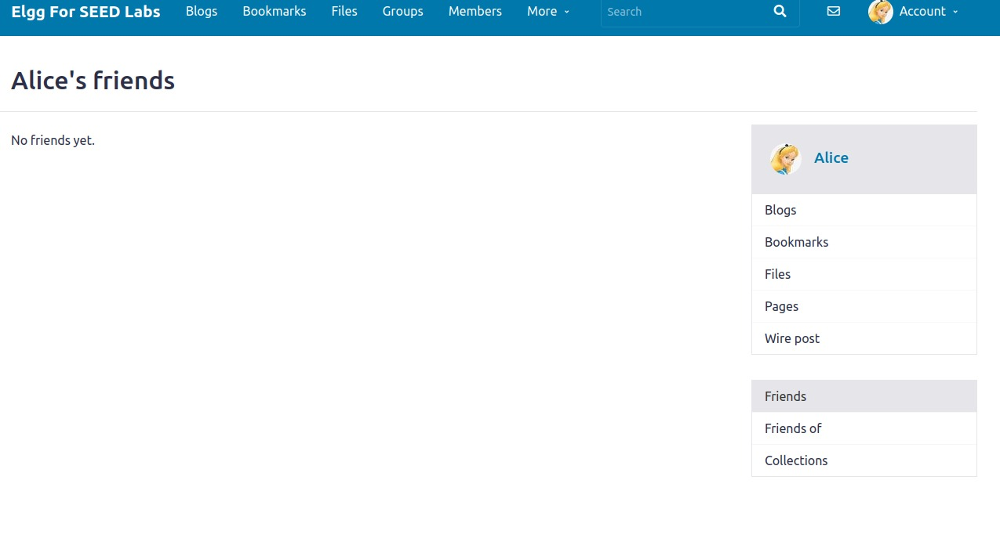
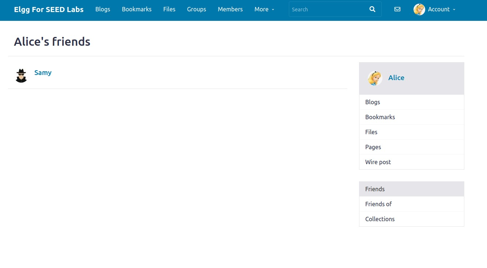

# **Week #10**

## **SEEDs Lab**

### **Task 1**

*  **Posting a Malicious Message to Display an Alert Window**

* We first write the following JavaScript code into the *"about me"* field of Alice.

| **Web Application**|
| :----------:|
|  |

* After we save the changes, the profile displays a pop up with the word *"XSS"*, the one we wrote in the alert. 

| **Web Application**  |
| :------------:|
|  |

### **Task 2**

* **Posting a Malicious Message to Display Cookies**

* We changed the previous code to the following, and wrote it into the *"brief description"* field of Boby in order to display the current cookie value in the session.

| **Web Application**|
| :----------:|
|  |

* As soon as we save this changes, the profile displays Boby's cookie value and his brief description is empty, so the JavaScript code was executed. 

| **Web Application**|
| :----------:|
|  |

### **Task 3**

* **Stealing Cookies from the Victim’s Machine**

* In the previous task, the cookies could only be seen by the user, not by the atacker.

* In order to get the cookie of the victim to the atacker, we write the following code into the atacker's (Alice) *"about me"* field. It sends the cookies to the port 5555 of the ip 10.9.0.1

| **Web Application**|
| :----------:|
|  |

* We are able to get the cookies value when we log in as Boby and visit Alice's profile.

**Web Application** | **Web Application**
:---------:|:---------:
 | 

| **Web Application**|
| :----------:|
|  |

* When the injected code insert the img tag, the browser tries to load the image from the **url** in the **src** field. This results in an HTTP GET request sent to the attacker's machine. 

### **Task 4**

* **Becoming the Victim’s Friend**

* To create our **HTTP GET** request to make friends, we logged in as Alice and added Samy as a friend in order to
see how the request looks like.

| **Web Application**|
| :----------:|
|  |

* We can see that friend has a value of 59 so we understand that guid of Samy is 59.

* In order to create the request we added the following code into the *"About me"* section in Samy's profile.

| **Web Application**|
| :----------:|
|  |

* We log out and log in as the victim Alice and visit Samy's profile to see if Samy's is added as a friend.

**Web Application** | **Web Application**
:---------:|:---------:
 | 

| **Web Application**|
| :----------:|
|  |

* As we can see Samy's was successfully added to Alice's Friends.

* **Question 1**: Explain the purpose of Lines ➀ and ➁, why are they are needed?

    * The lines ➀ and ➁ are needed because if we dont have the secret token and timestamp value of the website attached to the request, this will not be considered legitimate and hence will throw out an error and our atack won't be successful.

* **Question** 2: If the Elgg application only provide the Editor mode for the "About Me" field, i.e.,
you cannot switch to the Text mode, can you still launch a successful attack?

    * No, we won't be able to launch a successful atack because this mode encodes any special character in the input. Since, for our code we need to have  and other tags, all of them will be encoded into data and the code won't be executed.

## **CTF Week #10**

### **CTF Week #10 1**

### **CTF Week #10 2**

#### **Checksec**

- Address randomization is active
- Regions in the memory with RWX permissions
- No cannaries in the stack
- Architecture is x86
- Stack has execute permissions (NX -no execute- disabled)
