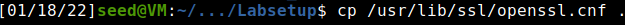
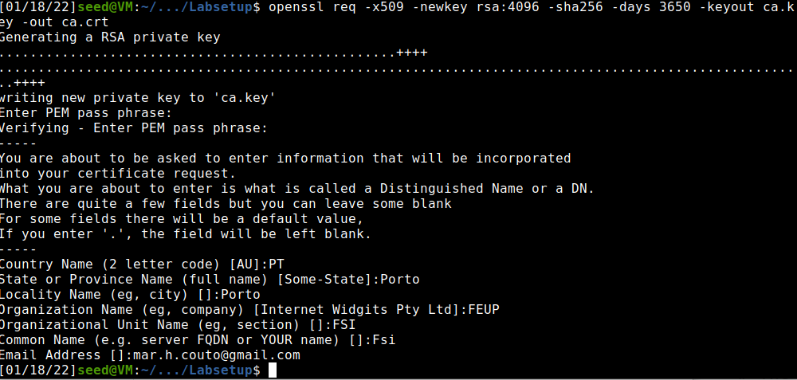
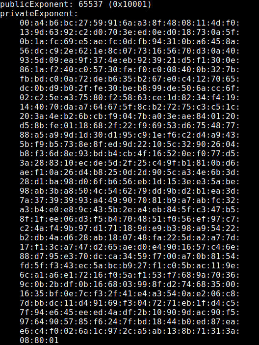
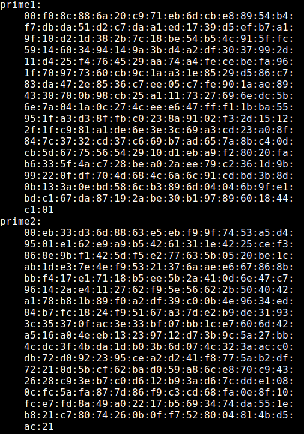
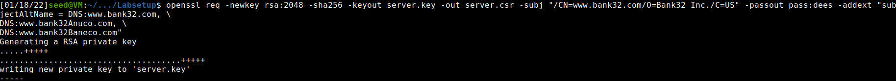
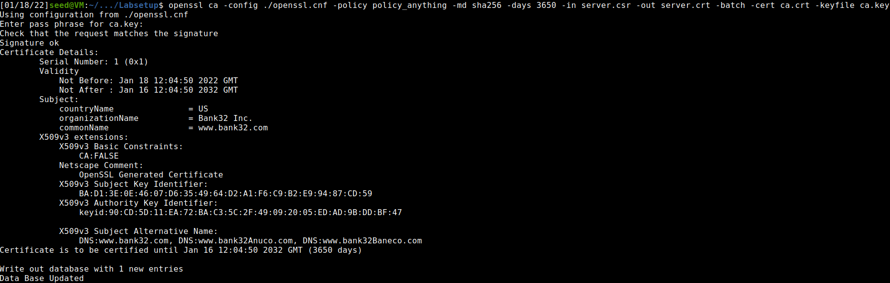
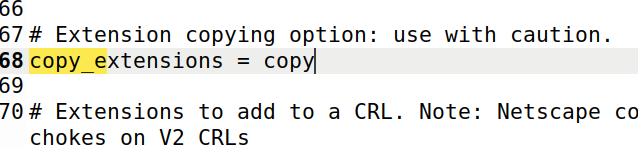
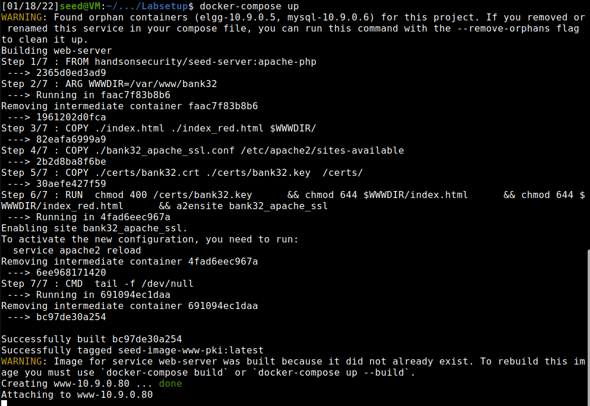
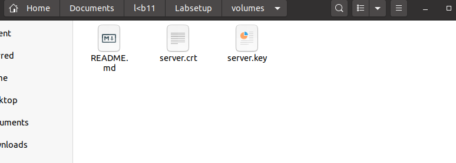
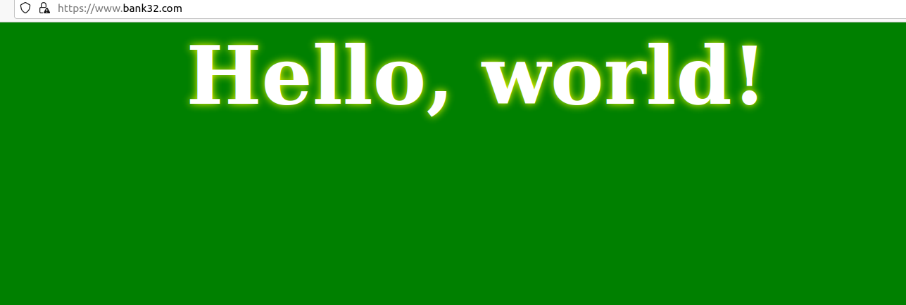

# **Week 10**

## **SEEDs Lab**

https://seedsecuritylabs.org/Labs_20.04/Crypto/Crypto_PKI/

### **Task 1**

- We started by copying openssl.cnf to our working directory, so we could make the necessary changes to it.

| **Copy openssl.cnf**|
| :----------:|
||
- Uncommented 'unique_subject' parameter, just like requested

| **Edit copied file**|
| :----------:|

- Created the necessary files and directories, as appointed in the openssl.cnf file
- Now we had to create a self-signed certificate for the CA, which will make it fully trusted. 

| **Generate self signed certificate**|
| :----------:|

- Looking at the content of the resulting files we can answer the following questions:
    - **Q1:** What part of the certificate indicates this is a CA certificate?
    - **A1:** Basic constraints: flag identifying certificate is CA 
    
    | **Basic constraints flag**|
    | :----------:|
    
    - **Q2:** What part of the certificate indicates this is a self-signed certificate?
    - **A2:** Issuer and subject of certificate are the same

    | **Self-signed proof**|
    | :----------:|
    
    - **Q3:** In the RSA algorithm, we have a public exponent e, a private exponent d, a modulus n, and two secret numbers p and q, such that n = pq. Please identify the values for these elements in your certificate and key files.
    - **A3:** n is modulus, p and q are prime1 and prime2

Modulus | Exponents | Primes
:---------:|:---------:|:--------:
 |  | 


### **Task 2**

For a company to get a public-key certificate from our CA. For that: 
- first we need to generate a Certificate Signing Request (CSR) (inlcudes company's public key and information)
- we also added some lines which allowed the certificate to have alternative names

| **Creating a CSR**|
| :----------:|


### **Task 3**

Now, we can turn the CSR created in the previous task into a self-signed certificate by:
- Editing the copied openssl file to enable 'openssl ca' to copy the extension field from the request to the final certificate
- Using the files created in task one (a CA certicate and its key) to sign the request

| **Transforming request into certificate**| 
| :----------:|


|**Editing openssl file** |
| :----------:|


### **Task 4**

We will deploy the certificate we made in an apache-based https website, hosted in a docker container:
- Configure 'bank32_apache_ssl.conf' so that it corresponds to our server's data (namely change the path to the certificate and key we generated)
- To get the correct certificate and key in the container which will host the server we need to to one of three:
    - Change the names and paths of the files of the key and certificate to the ones mentioned in the dockerfile in for the server given so that these are copied to the correct directory on the container
    - Change the entries in the dockerfile where the path to key and certificate are stated
    - Use the volumes folder to pass the key and certificate files inside the container and then relocate them
- Enable apache's ssl module and the site in question
- Start the apache server
- Go to the correct location in the browser

|**New bank32_apache_ssl.conf** |
| :----------:|


|**Launching the container** |
| :----------:|


|**Enabling apache ssl module** |
| :----------:|
```
a2enmod ssl 
a2ensite bank32_apache_ssl
```

|**Copying certificate and key inside the container and** | **Launching the website** |
| :----------:|:--------:|
 |  

|**Accessing the website** | **Verifying the certificate**|
| :----------:|:---------:|
 |  


### **Task 5**

To prove the efficiency PKI infrastructure, we will try to launch a MIDM attack (Men in the Middle).

- first, we change our the server name in the bank32_apache_ssl.conf file
- then we change the entry of /etc/hosts file for 10.9.0.80 to map it to the website we want to fake (in our case facebook)
- finally, we access the website and document the results

|**New bank32_apache_ssl.conf** |
| :----------:|


|**Change /etc/hosts** |
| :----------:|


|**Trying access file** | **Certificate** |
| :----------:|:----------:|
|

We cannot access the website, which proves the MITM attack is defeated by the use of PKI infrastructure. This happens because the common name does not match, which would only happen if the server had a valid CA cerficate for it.

