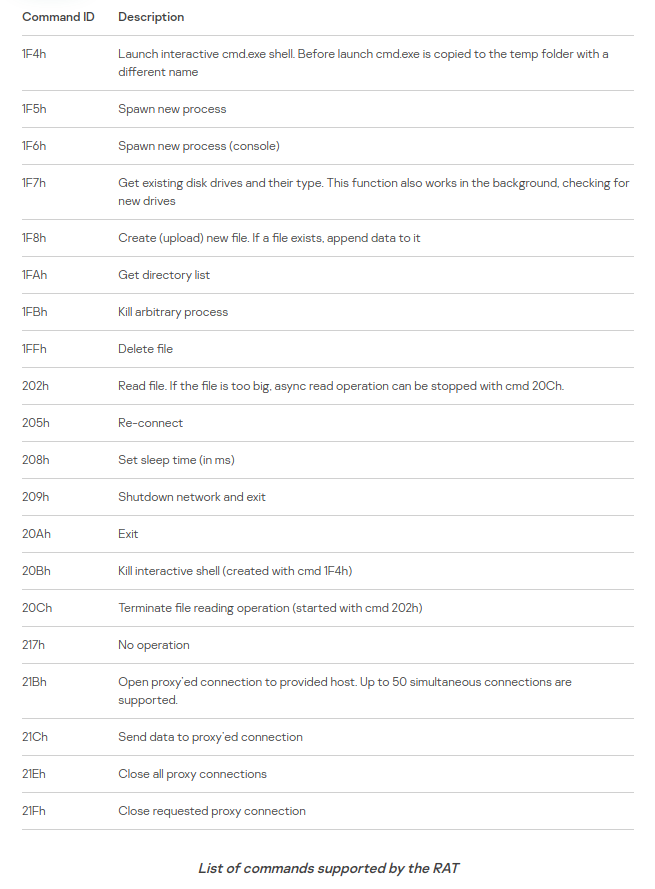

# **Week #3**

## **Identification and Cataloging of a CVE**

### **Identification**
- **CVE-2021-40449**

- [Use-after-free vulnerability](https://encyclopedia.kaspersky.com/glossary/use-after-free/) (Incorrect use of dynamic memory during program operation)

- **Privilege escalation vulnerability** affecting the ***NtGdiResetDC*** function in **win32k kernel driver**. This exploits are used to **deliver remote access Trojans (RATs)**.

-  Affected systems:
   - Windows Vista
   - Windows 7
   - Windows 8
   - Windows 8.1
   - Windows Server 2008
   - Windows Server 2008 R2
   - Microsoft Windows Server 2012
   - Microsoft Windows Server 2012 R2,
   - Microsoft Windows 10 (build 14393)
   - Microsoft Windows Server 2016 (build 14393)
   - Microsoft Windows 10 (build 17763)
   - Microsoft Windows Server 2019 (build 17763)
   - The exploit was only tested in **Microsoft Windows 10 (build 14393)** and **Microsoft Windows 10 (build 17763)**

- The exploit had numerous debug strings from an older exploit [CVE-2016-3309](https://github.com/siberas/CVE-2016-3309_Reloaded/)

### **Cataloging**

- **Zero-day vulnerability**, exploitation detected.

- Microsoft acknowledged [Boris Larin](https://twitter.com/oct0xor) on the 12th of October 2021, for reporting the vulnerability, currently working for ***Kaspersky GReAT***.

- According to [NVD](https://nvd.nist.gov/vuln/detail/CVE-2021-40449#match-7025675) 7.8.

### **Exploit**

- **MysterySnail** is a remote shell-type Trojan which can collect and steal system information from compromised hosts and also provides a gateway to other attacks such as ransomware.

- Before receiving any commands, it can gather and send information such as:
    - Computer name
    - Current OEM code-page/default identifier
    - Windows Product name
    - Local IP address
    - Logged-in user name
    - Campaign name

- List of **commands** that this RAT can perform!

- The vulnerability can lead to leakage of kernel module addresses in the computers memory, typically associated with a UAF vulnerability.

- The Trojan, a [RAT](https://encyclopedia.kaspersky.com/glossary/rat-remote-access-tools/), is used to gain access remotely to other devices connected to the Internet or local network. Can also, launch the **cmd.exe** interactive shell (by copying the **cmd.exe** file to a temp folder under a different name).

- [Exploit available in github](https://github.com/ly4k/CallbackHell)

### **Atacks**

- Kaspersky technologies **detected** a series of attacks, on multiple Microsoft Windows servers, with the help of the **Behavioral Detection Engine** and the **Exploit Prevention component**, before any damage was inflicted.

- This exploit had many debug strings from an older, publicly known exploit for vulnerability **CVE-2016-3309**, but closer analysis revealed a new zero-day.

- Attack has been **linked** with the infamous **IronHusky group** a Chinese-speaking APT.

- Variants of this malware were being used in widespread espionage campaigns **targeting** IT companies, military, defense contractors and diplomatic entities.  
