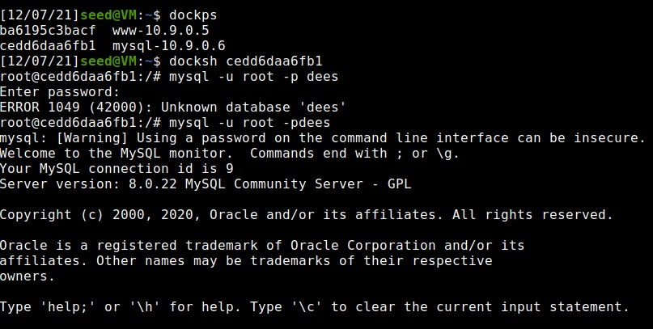
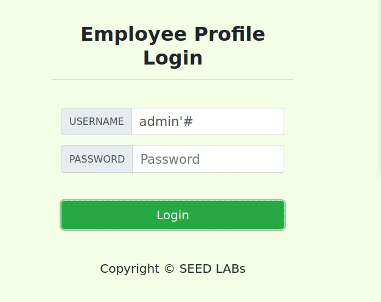
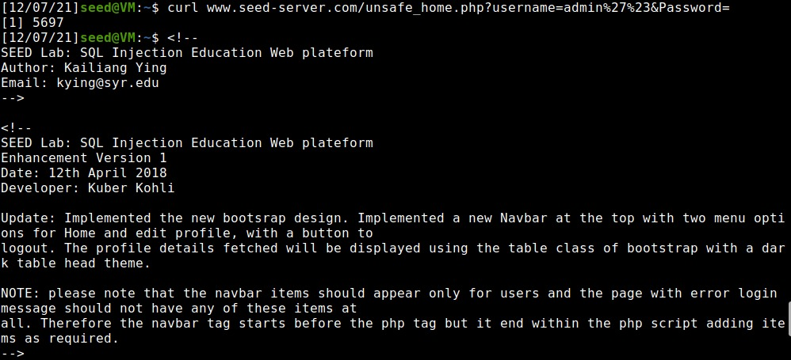
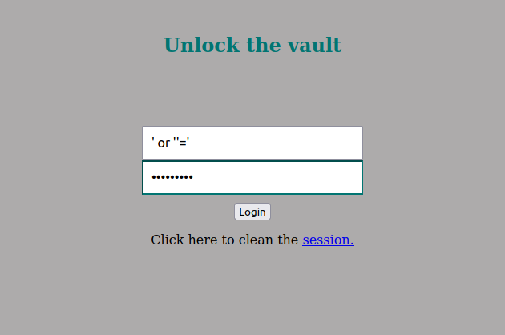
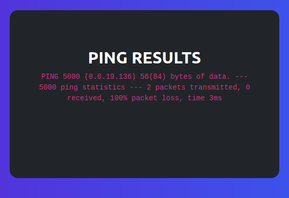
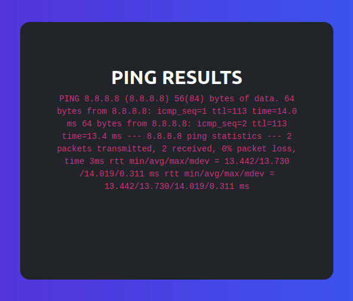
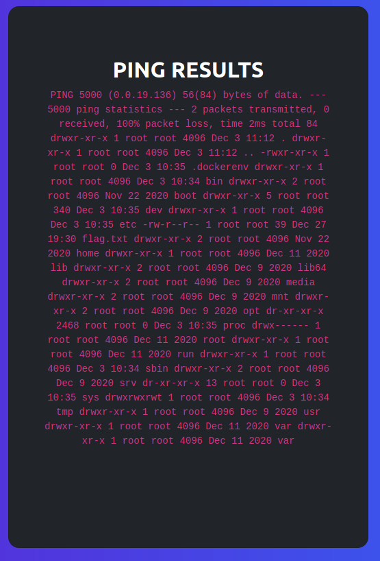

# **Week #8 && #9**

## **SEEDs Lab**

### **Task 1**

* Get Familiar with SQL Statements

* Login into MySQL using ***root*** as username and ***dees*** as password

| **Terminal**|
| :----------:|
|  |

* Use a SQL Command to print all the profile information of the employee Alice.

| **Terminal**  |
| :------------:|
|  |


### **Task 2**

* SQL injection is basically a technique through which attackers can execute their own malicious SQL statements generally referred as malicious payload. Through the malicious SQL statements, attackers can steal
information from the victim database; even worse, they may be able to make changes to the database. Our
employee management web application has SQL injection vulnerabilities, which mimic the mistakes frequently made by developers.

* unsafe_home.php code snippet, containing the vulnerability

```php code
    $input_uname = $_GET[’username’];
    $input_pwd = $_GET[’Password’];
    $hashed_pwd = sha1($input_pwd);
    ...
    $sql = "SELECT id, name, eid, salary, birth, ssn, address, email,
    nickname, Password
    FROM credential
    WHERE name= ’$input_uname’ and Password=’$hashed_pwd’";
    $result = $conn -> query($sql);
    
    // The following is Pseudo Code
    if(id != NULL) {
    if(name==’admin’) {
        return All employees information;
    } else if (name !=NULL){
        return employee information;
    }
    } else {
        Authentication Fails;
    }
```

#### **Task 2.1**

* Log in into the web application as the administrator from the login page, so that you can see the information of all employees. Exploiting the php query vulnerability.

| **Web Application** |
| :-----------------: |
|  |

* After clicking login, we get the following output

| **Web Application** |
| :-----------------: |
|  |

The single quote after entering a valid username existing in the database, closes the argument for the input username and the # sign consequently makes everything after the username to be commented out. Hence, we were able to get all the information about the employees using the admin ID.


#### **Task 2.2**

* Repeat **Task 2.1** but from the command line.

| **Terminal** |
| :-----------------: |
|  |
|  | 

We use the curl command to place and HTTP request to the webapplication and perform the login from the command line. For the username we need to pass admin'# which are special caracters, and therefore need to be enconded. We used the following encodings ***Quote (') %27*** and ***Hash (#) %23***.

#### **Task 2.3**

* There is a countermeasure preventing you from running two SQL statements in this attack. Please use
the SEED book or resources from the Internet to figure out what this countermeasure is, and describe your
discovery in the lab report.

* Error upon trying to run two sequential SQL statements.

| **Web Application** |
| :-----------------: |
|  |

This SQL injection does not work in MySQL because PHP's mysqli extension, mysqli::query() API does not allow multiple queries to run in the databse server. The limitation is inserted by the extension not the SQL server itself. This mysqli limitation can be overcome by using mysqli->multiquery(). 

### **Task 3**

* If a SQL injection vulnerability happens to an UPDATE statement, the damage will be more severe, because attackers can use the vulnerability to modify databases. In our Employee Management application,
there is an Edit Profile page (Figure 2) that allows employees to update their profile information, including
nickname, email, address, phone number, and password. To go to this page, employees need to log in first.
When employees update their information through the Edit Profile page, the following SQL UPDATE
query will be executed. The PHP code implemented in unsafe edit backend.php file is used to update employee’s profile information. The PHP file is located in the /var/www/SQLInjection directory

```php code
   $hashed_pwd = sha1($input_pwd);
   $sql = "UPDATE credential SET
        nickname=’$input_nickname’,
        email=’$input_email’,
        address=’$input_address’,
        Password=’$hashed_pwd’,
        PhoneNumber=’$input_phonenumber’
        WHERE ID=$id;";
   $conn->query($sql); 
```

#### **Task 3.1**

* Modify your own salary

| **Web Application** |
| :-----------------: |
|  |

| **Terminal** |
| :-----------------: |
|  |

| **Web Application** |
| :-----------------: |
|  |

To modify Alice's salary we used the NickName text box to run the specific MySQL command : **Alice$$', Salary='1000000' WHERE EID='10000'#**.

#### **Task 3.2**

* Modify other's people salary 

| **Web Application** |
| :-----------------: |
|  |

| **Terminal** |
| :-----------------: |
|  |

| **Web Application** |
| :-----------------: |
|  |

To modify Boby's salary we used the NickName text box to run the specific MySQL command : **DumbBoss$$', Salary=1 WHERE Name='Boby'#**.

#### **Task 3.3**

* Knowing the password has been hashed using SHA 1, we get the hased password from the credential table, using Boby's row.

| **Terminal** |
| :-----------------: |
|  |

* Then we used a SHA 1 decoder, to get Boby's password. And the we successfully log in into Boby's account, using the correct credentials.

| **Web Application** |
| :-----------------: |
|  |

## **CTF Week #8 and #9**

### **CTF Week #8 1**

* This CTF is all about SQL Injection, where we are given a login page, and we have to try to login as admin. We tried the basic common SQL Injection type queries ***" or ""="*** and ***' or ''='***. Being the second one, the one who works.

| **Web Page** |
| :----------: |
|  |
|  |

### **CTF Week #8 2**

* Firstly, given that we are ***black-boxed***, we start by analysing what features are available to non-authenticated users:
  *  Login
  *  Speed Report
  *  Ping a Host

* We can try to blindly SQL inject the login form, with common used SQL injection commands. Not successfull.

* We can try to explore the ping a host system. 
  * We can attempt to ping ports in the current network. Like the server locate port for the challenge ***5000***.

| **Web Page** |
| :-----------:|
|  |

* By observing the screenshot above, we can assume that the server is probably using a bash/terminal to run the unix command ping. To ensure our observation we'll try to ping a known server (Google 8.8.8.8).

| **Web Page** |
| :-----------:|
|  |

* Our hypothesis is validated, the server is probably running a unix type bash, for the sake of using the ping command.

* Now we will simply try to run a simple bash command, to figure out what kind of files are in the current directory **ls**.

| **Web Page** |
| :-----------:|
|  |

* Now we need to use ls but in another directory to see the contents inside the server, so instead of **ls** we use **ls / -la**

| **Web Page** |
| :-----------:|
|  |

* So after analysing the contents of the server, we see that we have a file called *flag.txt*. In order to retrieve the flag, we only need to execute the command ***cat /flag.txt***.

| **Web Page** |
| :-----------:|
|  |

